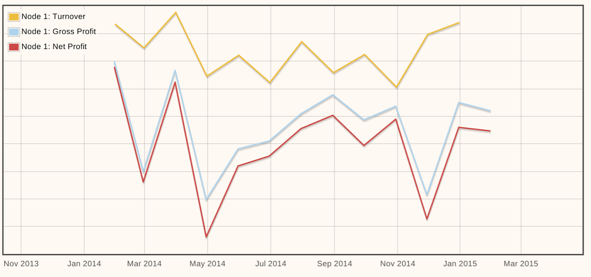

# kash_emoncms_flow

Extract Turnover, Gross & Net profit data from [KashFlow accounting](http://kashflow.com) API  and post to [emoncms.org](http://emoncms.org) for better graphing :-) 

Uses KashFlow API Ruby Wrapper: https://github.com/pogodan/kashflow

*Partly written as an exercise in learning Ruby, improvement suggestions welcome*

# Install 

*...from scratch!*

    sudo apt-get install ruby

    sudo apt-get install ruby-dev

    sudo gem install kashflow         

    sudo gem install activesupport

    sudo gem install http
    

